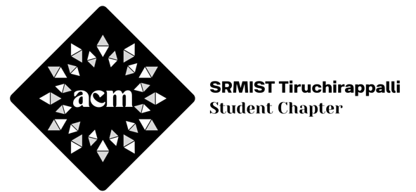

  
  <h1>🎓 ACM SRMIST Tiruchirappalli Student Chapter 🚀</h1>
  
<strong>Empowering students through technology, collaboration, and innovation.</strong>

---

## 🌟 About the Project

Welcome to the official repository for the **ACM SRMIST Tiruchirappalli Student Chapter** website! 🌐 This platform is designed to be the digital home for our computing community, showcasing our technical events, leadership, galleries, and ways for students to engage and grow.

Built with performance, modern aesthetics, and smooth interactivity in mind, the website serves as the primary touchpoint for both current members and aspiring tech enthusiasts.

## ✨ Key Features & Highlights

Here's what makes this website special and what we have implemented:

*   **📱 Fully Responsive Design**: Built mobile-first using Tailwind CSS, ensuring a seamless experience across phones, tablets, and desktops.
*   **🎭 Stunning Visual Effects**: 
    *   **Glassmorphism & Gradients**: Premium UI design with frosted glass elements (`GradualBlur`) and animated gradient borders.
    *   **Advanced Animations**: Leveraged `framer-motion` and `gsap` for silky smooth scroll animations, text rotations (`RotatingText`), and interactive bento grids (`MagicBento`).
    *   **Immersive Hero Section**: Featuring dynamic tech-themed backgrounds and 3D visual cues.
*   **🗓️ Event Management**: 
    *   **Showcases**: Carousels and auto-scrolling photo galleries to highlight past tech events, hackathons, and workshops.
    *   **Dedicated Event Pages**: Detailed views for specific events to provide schedules and registration info.
*   **👥 Seamless Onboarding (Join Us Flow)**:
    *   A custom-built, fully responsive modal that guides users based on their affiliation.
    *   **SRMIST Students**: Direct access to chapter application forms.
    *   **Global Members**: Easy routing to global ACM membership pathways.
    *   **One-Click Contact**: Integrated `mailto:` functionality directly connects applicants to `connect@srmtrichy.acm.org`.
*   **⚡ Modern Tech Stack**: Powered by **Next.js 14**, **React**, and **TypeScript** for maximum speed, type-safety, and SEO optimization.

## 🛠️ Technology Stack

*   **Framework**: [Next.js](https://nextjs.org/) (App Router)
*   **Language**: [TypeScript](https://www.typescriptlang.org/)
*   **Styling**: [Tailwind CSS](https://tailwindcss.com/) + Custom CSS Modules
*   **Animations**: [Framer Motion](https://www.framer.com/motion/) + [GSAP](https://gsap.com/)
*   **Components**: Integrated premium open-source UI components (React Bits)

## 🚀 Live Deployment

The website has been successfully deployed and is live for the world to see! 

**🔗 Visit our live site here:** [https://acm-srmtrichy.vercel.app/](https://acm-srmtrichy.vercel.app/) ✨

## 📬 Contact Us

Have questions, suggestions, or want to collaborate? 
Feel free to drop us an email at: **[connect@srmtrichy.acm.org](mailto:connect@srmtrichy.acm.org)** ✉️

---

  <i>Designed and developed with ❤️ by the ACM SRM Trichy Team.</i>

